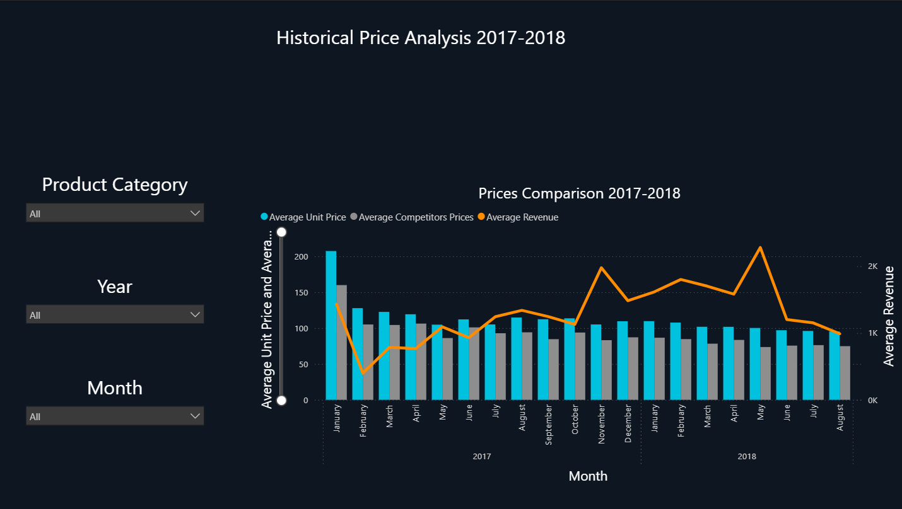
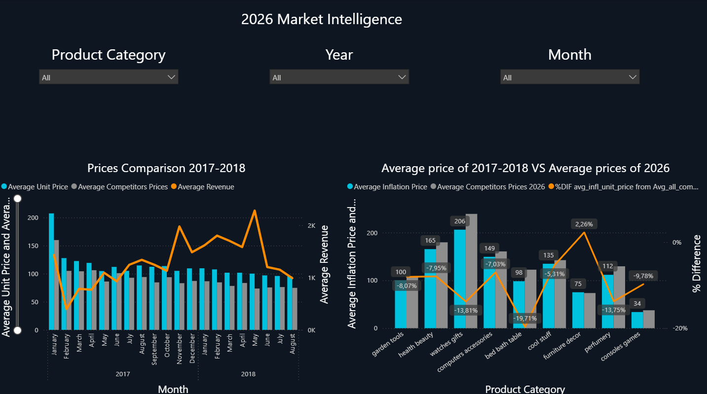
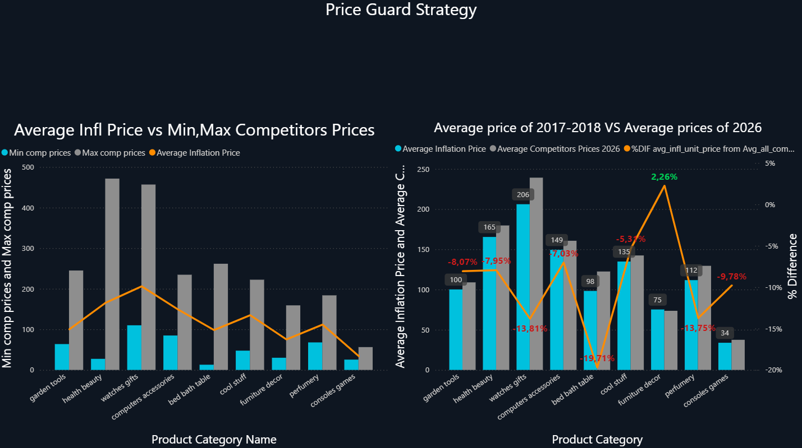
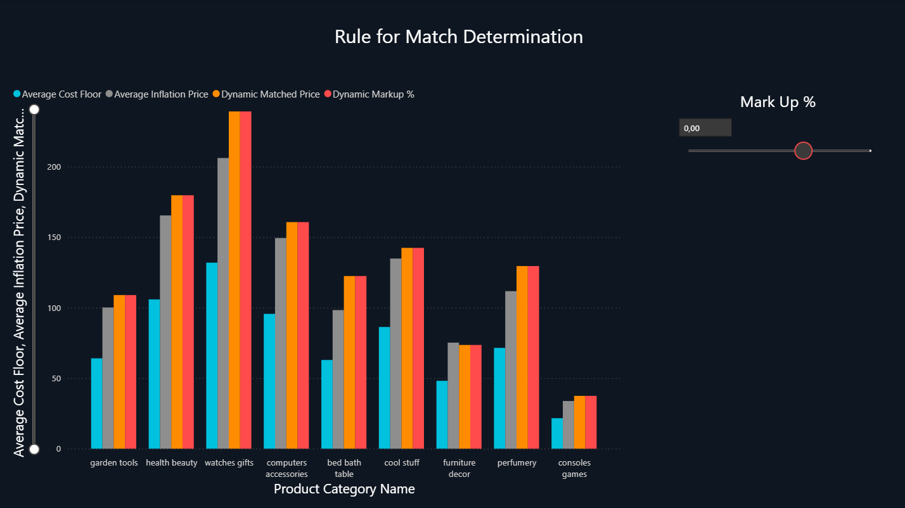

# Strategic Pricing Analysis

An interactive pricing analysis to help businesses maintain market competitiveness while protecting profit margins, identifying categories that need adjustments, and enabling strategic, data-driven pricing decisions.

---

## Team Members

- Elena Moysidou
- Antonis Karousis
- Christos Karlaftis

---

## Project Description

This project investigates pricing strategies to help businesses maintain market competitiveness while protecting profit margins. Using sales and competitor pricing data, we perform data cleaning, exploratory data analysis (EDA), and build an interactive Power BI dashboard to visualize insights on optimal pricing adjustments and categories requiring real-time monitoring. The dashboard enables data-driven decision-making to maximize market share and safeguard future sales, ensuring both competitiveness and profitability.

---

## Data Source

The dataset used in this analysis is available on Kaggle:  
[Retail Price Optimization](https://www.kaggle.com/datasets/suddharshan/retail-price-optimization)

---

## Repository Structure

This repository is organized as follows:

- **Dashboard Screenshots/**  
  Contains images of the interactive Power BI dashboard.

- **Dashboard/**  
  The full interactive dashboard can be accessed [here](https://drive.google.com/drive/folders/13zyAhoXBpONW4jJJrmVqj48LrOJRjRkQ?usp=share_link)

- **Data/** 
  - **raw/**  
    Contains the original CSV datasets before any cleaning or preprocessing.
    - `raw_sales_data.csv`
    - `raw_competitor_pricing.csv`

  - **cleaned/**  
    Contains cleaned and processed CSV files used for analysis and visualization.
    - `clean_sales_data.csv`
    - `clean_competitor_pricing.csv`

- **Scripts/**
  - `web_scraping.py` – Script used to scrape competitor pricing data.
  - `data_cleaning.py` – Script used to clean and preprocess raw datasets.

- **requirements.txt**  
  Lists all Python packages required to run the web scraping and data cleaning scripts.

- **.gitignore**  
  Specifies files and folders ignored by Git.

- **README.md**  
  Project documentation and overview.

---

## Interactive Dashboard

Here are some snapshots of the dashboard:  

	
---

